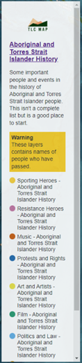
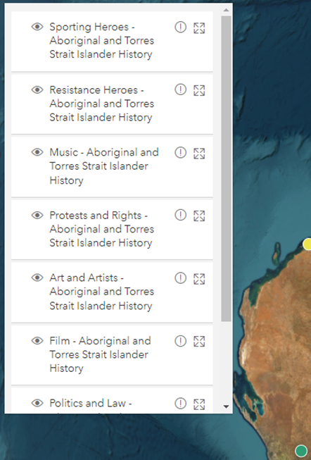

# Collection configurations

Collection configurations are the settings to control the look and behaviours of collection views. These configurations
are specified in the collection data feed.

```json
{
    "metadata": {
        // Collection metadata.
    },
    "datasets": [
        // Collection datasets.
    ],
    "display": {
        // Collection configurations.
    }
}
```

## Info block configurations

All [info block configurations](./global-configurations.md#info-block-configurations) still can apply to collection
views. In this case, the info block configurations are set in the collection data feed rather than the GeoJSON feed of
an individual dataset. When a collection of datasets is loaded by a collection view, all info block configurations set
in the individual dataset will be ignored.

Example:

```json
{
    "metadata": {
        // Collection metadata.
    },
    "datasets": [
        // Collection datasets.
    ],
    "display": {
        "info": {
            "title": {
                "text": "Aboriginal and Torres Strait Islander History",
                "link": "https://ghap.tlcmap.org/publiccollections/6"
            },
            "content": "<p>Some important people and events in the history of Aboriginal and Torres Strait Islander people. This isn't a complete list but is a good place to start.</p>"
        }
    }
}
```

### Legend

By default, the info block will have a legend displayed at the end of the info block.



The legend can be disabled by setting `legend` to `false`.

Example:

Disable the legend:

```json
{
    "metadata": {
        // Collection metadata.
    },
    "datasets": [
        // Collection datasets.
    ],
    "display": {
        "info": {
            "legend": false
        }
    }
}
```

## List pane

By default, collection views create a pane listing all datasets information in the collection. Users can use the list
to navigate to a particular dataset, or view more detailed information about the datasets.



To configure the list pane display, set `listPane` with one of the following values:

- `enabled`: display the list pane. This is the default value.
- `disabled`: disable the list pane.
- `hidden`: hide the list pane by default.

Example:

Disable the list pane:

```json
{
    "metadata": {
        // Collection metadata.
    },
    "datasets": [
        // Collection datasets.
    ],
    "display": {
        "listPane": "disabled"
    }
}
```
