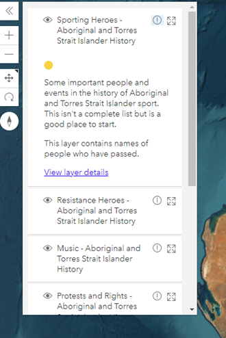

# Dataset configurations

Dataset configurations can be set to the dataset objects in the collection data feed.

## Color

By default, the collection view assigns a random color to each dataset within the collection. To set a particular color
for a dataset, set `color` in dataset configurations with the HEX color code.

> [!NOTE]
> all color configurations set on features in the dataset GeoJSON feed will be ignored when displayed in a collection 
view. However, the line color set on a route for the collection journey view can still apply. If no line color is set on
the routes of a dataset, the default color of lines would be same color as the node color when a dataset is visualised
in the collection journey view.

Example:

```json
{
    "metadata": {
        // Collection metadata.
    },
    "datasets": [
        {
            "name": "Deep time - Aboriginal and Torres Strait Islander History",
            "jsonURL": "https://ghap.tlcmap.org/publicdatasets/239/json",
            "display": {
                "color": "#000000"
            }
        }
    ],
    "display": {
        // Collection configurations.
    }
}
```

## List pane

The `listPane` configurations on the dataset level control the detailed information of datasets displayed in the list
pane.



By default, if no configuration is provided, the list pane will simply list the names of the datasets without any
detailed information. If a dataset has more detailed information provided, users can click on the "exclamation" icon to
expand the details about that dataset.

### Show color

A color dot representing the color of the dataset can be displayed in list pane. Set `showColor` to `true` to enable
this. By default, it's set to `false`.

Example:

```json
{
    "metadata": {
        // Collection metadata.
    },
    "datasets": [
        {
            "name": "Deep time - Aboriginal and Torres Strait Islander History",
            "jsonURL": "https://ghap.tlcmap.org/publicdatasets/239/json",
            "display": {
                "listPane": {
                    "showColor": true
                }
            }
        }
    ],
    "display": {
        // Collection configurations.
    }
}
```

### Content

The content of the dataset details in the list pane can be set via the `content` property. The value of the content can
be plain text or [restricted HTML](./global-configurations.md#restricted-html).

Example:

```json
{
    "metadata": {
        // Collection metadata.
    },
    "datasets": [
        {
            "name": "Deep time - Aboriginal and Torres Strait Islander History",
            "jsonURL": "https://ghap.tlcmap.org/publicdatasets/239/json",
            "display": {
                "listPane": {
                    "showColor": true,
                    "content": "<p>Some important people and events in the history of Aboriginal and Torres Strait Islander sport. This isn't a complete list but is a good place to start.</p><p><a href=\"https://ghap.tlcmap.org/publicdatasets/239\" target=\"_blank\">View more details</a></p>"
                }
            }
        }
    ],
    "display": {
        // Collection configurations.
    }
}
```
