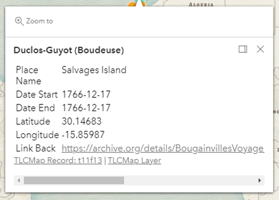

# Feature configurations

Feature configurations are the settings that control the display of an individual `Feature` object from the GeoJSON.
Each `Feature` object is rendered as a point marker in the map visualisation. This is done via the `display` property
of the `Feature` object, while each configuration is a property of the `display` object.

```json
{
    "type": "Feature",
    "display": {
        // Feature configurations.
    }
}
```

## Color

The color of the point markers displayed on the map can be specified via the `color` property. The default value is
`orange`. The value can be an array of rgb(a) values, named string, hex string or an hsl(a) string, an object with
r, g, b, and a properties. For more details of color value format, see the
[ArcGIS documentation](https://developers.arcgis.com/javascript/latest/api-reference/esri-symbols-SimpleMarkerSymbol.html#color).

Example:

Set the point color with a hex string:

```json
{
    "type": "Feature",
    "display": {
        "color": "#33cc33"
    }
}
```

## Popup



When clicking on a point marker from a feature, a popup will be displayed by default. The display of popups can be
controlled through the `popup` property in the feature display settings.

```json
{
    "type": "Feature",
    "display": {
        "popup": {
            // Popup configurations.
        }
    }
}
```

The popup can be disabled by setting the `popup` property to `false`.

```json
{
    "type": "Feature",
    "display": {
        "popup": false
    }
}
```

### Title

The `title` property in the popup settings sets the content of popup title. The value is a string which can support
interpolation. The names of properties from the `Feature` object can be referenced as placeholders wrapped with curly
brackets `{}`. The default value of the popup title is the static text "Place".

Examples:

Set the popup title using static text:

```json
{
    "type": "Feature",
    "display": {
        "popup": {
            "title": "A place I visited"
        }
    }
}
```

Set the popup title using feature properties:

```json
{
    "type": "Feature",
    "display": {
        "popup": {
            "title": "{title} – {date}"
        }
    },
    "properties": {
        "title": "A place I visited",
        "date": "2002-05-06"
    }
}
```

### Content

The main content of the popup can be set with the property `content`, which accepts a string in restricted HTML format
with the support of interpolation.

Example:

Set the popup content with feature properties:

```json
{
    "type": "Feature",
    "display": {
        "popup": {
            "title": "{title} – {date}",
            "content": "<p>{summary}</p><p>{city} {date}</p>"
        }
    },
    "properties": {
        "title": "A place I visited",
        "date": "2002-05-06",
        "summary": "The beach was a wonderland of white sand and crystal-clear water. The sun was shining brightly in the sky, and the waves were crashing against the shore.",
        "city": "Sydney"
    }
}
```

### Feature properties

By default, the popup will display all feature properties in a table after the popup content. `allowedFields` in popup
settings serves as a white list allowing users to define the feature properties to be displayed, while `blockedFields`
serves as a black list allowing users to hide feature properties from displaying.

Examples:

Display a set of selected feature properties:

```json
{
    "type": "Feature",
    "display": {
        "popup": {
            "title": "{title}",
            "allowedFields": ["date", "summary", "city"]
        }
    },
    "properties": {
        "title": "A place I visited",
        "date": "2002-05-06",
        "summary": "The beach was a wonderland of white sand and crystal-clear water. The sun was shining brightly in the sky, and the waves were crashing against the shore.",
        "city": "Sydney"
    }
}
```

Block some feature properties from displaying:

```json
{
    "type": "Feature",
    "display": {
        "popup": {
            "title": "{title} – {date}",
            "blockedFields": ["title", "date"]
        }
    },
    "properties": {
        "title": "A place I visited",
        "date": "2002-05-06",
        "summary": "The beach was a wonderland of white sand and crystal-clear water. The sun was shining brightly in the sky, and the waves were crashing against the shore.",
        "city": "Sydney"
    }
}
```

Set the `allowedFields` to an empty array to remove the property table from the popup display completely:

```json
{
    "type": "Feature",
    "display": {
        "popup": {
            "title": "{title} – {date}",
            "content": "<p>{summary}</p><p>{city} {date}</p>",
            "allowedFields": []
        }
    },
    "properties": {
        "title": "A place I visited",
        "date": "2002-05-06",
        "summary": "The beach was a wonderland of white sand and crystal-clear water. The sun was shining brightly in the sky, and the waves were crashing against the shore.",
        "city": "Sydney"
    }
}
```

### Property labels

When feature properties are displayed in the table, the property names will be displayed in the first column of the
table by default. To display user-friendly labels of the properties instead, the property name-to-label mapping can be
provided via the `fieldLabels` configuration. The value of `fieldLabels` is a JSON object using the property names as
keys and desired labels as values.

Example:

Provide property labels for displaying:

```json
{
    "type": "Feature",
    "display": {
        "popup": {
            "title": "{title}",
            "fieldLabels": {
                "title": "Title",
                "date": "Date",
                "created_at": "Created at",
                "original_id": "Original ID"
            }
        }
    },
    "properties": {
        "title": "A place I visited",
        "date": "2002-05-06",
        "created_at": "2020-07-21",
        "original_id": "34582"
    }
}
```

### Links

Users can specify links to be displayed at the bottom of the popup window. One of the common use cases is to provide a
link which direct users to a page containing more information about the feature, such as the source page. `links`
configuration accepts an array of link object. If multiple links are provided, the links displayed will be separated by
`|`.

A link object can contain the `text` and `link` of the link with the optional `target`. The target is default to 
`_blank`. Check the [MDN documentation](https://developer.mozilla.org/en-US/docs/Web/HTML/Element/a) for list of
valid `target` values.

Example:

Display a "read more" link:

```json
{
    "type": "Feature",
    "display": {
        "popup": {
            "title": "{title} – {date}",
            "content": "<p>{summary}</p><p>{city} {date}</p>",
            "allowedFields": [],
            "links": [
                {
                    "text": "Read more…",
                    "link": "https://example.com/page-1",
                    "target": "_blank"
                }
            ]
        }
    },
    "properties": {
        "title": "A place I visited",
        "date": "2002-05-06",
        "summary": "The beach was a wonderland of white sand and crystal-clear water. The sun was shining brightly in the sky, and the waves were crashing against the shore.",
        "city": "Sydney"
    }
}
```

## Line color

This configuration only applies in the journey view, which controls the line color of the journey route. To set up the
color of a line, set the `color` configuration on the `LineString` geometry `Feature` object. The default color of lines
is `white`.

Example

Set the color to "red" for a route.

```json
{
    "type": "Feature",
    "geometry": {
        "type": "LineString",
        "coordinates": [
            [150.9177778, -33.93166667],
            [151.2094444, -33.865],
            [150.7511111, -33.59833333]
        ]
    },
    "display":{
        "color": "red"
    }
}
```

## Line width

This configuration only applies in the journey view, which controls the line thickness of the journey route. To set up
the width of a line, set the `lineWidth` configuration on the `LineString` geometry `Feature` object. The default line
width is `2`.

Example

Set the line width of a route to 5.

```json
{
    "type": "Feature",
    "geometry": {
        "type": "LineString",
        "coordinates": [
            [150.9177778, -33.93166667],
            [151.2094444, -33.865],
            [150.7511111, -33.59833333]
        ]
    },
    "display":{
        "lineWidth": 5
    }
}
```

## Applying feature configurations globally

All feature configurations can be set to the parent `FeatureCollection` object if all features within that collection
share the same set of configurations. This will reduce the redundancy of the GeoJSON data if the configurations are
consistent across the features.

While having the global feature configurations, each feature can also set the configurations which only apply to that
feature. The configurations set within a `Feature` object will override the global feature configurations.

For example:

```json
{
    "type": "FeatureCollection",
    "display": {
        "info": {
            "title": "Places I visited",
            "content": "This is a collection of places that I visited in the past"
        },
        "color": "blue", // Global config of feature marker color 
        "popup": { // Global config of feature popups
            "title": "{title}",
            "content": "<p>{summary}</p><p>{city} {date}</p>",
            "allowedFields": []
        }
    },
    "features": [
        {
            "type": "Feature",
            "display": {
                "popup": {
                    "links": [ // Local config of popup links.
                        {
                            "text": "Read more…",
                            "link": "https://example.com/page-1",
                            "target": "_blank"
                        }
                    ]
                }
            },
            "properties": {
                "title": "A place I visited",
                "date": "2002-05-06",
                "summary": "The beach was a wonderland of white sand and crystal-clear water. The sun was shining brightly in the sky, and the waves were crashing against the shore.",
                "city": "Sydney"
            }
        },
        // more features…
    ]
}
```
