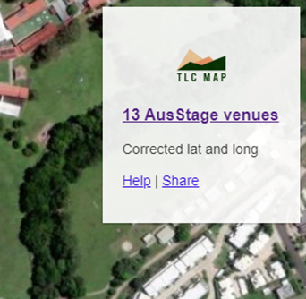
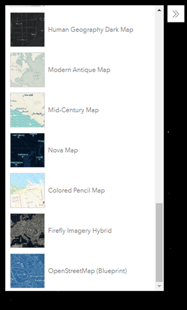
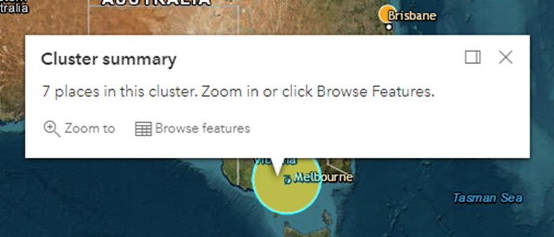

# Global configurations

Global configurations apply to the overall map displaying of the whole dataset. Global configurations should be
specified as properties in the `display` object of the top-level data object, which normally is the `FeatureCollection`
object.

```json
{
    "type": "FeatureCollection",
    "display": {
        // Global configurations
    }
}
```

## Info block configurations

The info block configurations can be specified by setting up the `info` property inside the `display` object of the
`FeatureCollection` object.

```json
{
    "type": "FeatureCollection",
    "display": {
        "info": {
            // Info block configurations.
        }
    }
}
```

### Display

The info block is the block displaying in the top-right corner of the map view.



To configure the info block display, use property `display` in the info block settings and set it to following values:
- `enabled`: display the info block. This is the default value.
- `disabled`: disable the info block.
- `hidden`: hide the info block by default.

Example:

Disable the info block:

```json
{
    "type": "FeatureCollection",
    "display": {
        "info": {
            "display": "disabled"
        }
    }
}
```

### Logo

By default, the info block would have the TLCMap logo displayed at the top of the block. This can be replaced or
removed by the logo property in the info block settings. The value of the property can be a URL to the logo image or
set to `false` to disable the logo display.

Example:

Set the info block logo:

```json
{
    "type": "FeatureCollection",
    "display": {
        "info": {
            "logo": "https://views.tlcmap.org/img/tlcmaplogofull_sm50.png"
        }
    }
}
```

### Title

Following the logo, the info block displays the title of the whole dataset. The title can be set by the `title` property
in info block settings. The value can be the text of the title or a [link object](./feature-configurations.md#links).

Examples:

Set a plain text title:

```json
{
    "type": "FeatureCollection",
    "display": {
        "info": {
            "title": "13 AusStage venues"
        }
    }
}
```

Set a linked title:

```json
{
    "type": "FeatureCollection",
    "display": {
        "info": {
            "title": {
                "text": "13 AusStage venues",
                "link": "https://ghap.tlcmap.org/publicdatasets/247"
            }
        }
    }
}
```

### Content

The main content of the info block can be set via the `content` property. The value of the content can be plain text or
restricted HTML.

Example:

Set the content in HTML of the info block:

```json
{
    "type": "FeatureCollection",
    "display": {
        "info": {
            "content": "<p>Corrected lat and long</p><p><a href="/guides/views/" target="_blank">Help</a> | <a href="/guides/views/#shareview" target="_blank">Share</a></p>"
        }
    }
}
```

### Restricted HTML

Any HTML from the GeoJSON data for rendering will go through a number of HTML filters before displaying. Other HTML tags
or attributes except the following will be stripped out from the rendered HTML.

```
p a[href|target] strong em ul ol li div[class] br table tr td th tbody thead tfoot
```

## Base map gallery



TLCMap views allows users to change the base map style via the base map gallery widget. This is enabled by default.
Use `basemapGallery` to enable/disable the gallery widget, which accepts a Boolean type value.

Example:

Disable the base map gallery:

```json
{
    "type": "FeatureCollection",
    "display": {
        "basemapGallery": false
    }
}
```

## Default base map

The default base map is the initial base map style loaded by TLCMap views. Property `basemap` accepts a base map name to
specify the default base map. For the list of available base map names, see the
[For use without an API key](https://developers.arcgis.com/javascript/latest/api-reference/esri-Map.html) section from
the ArcGIS documentation. The default value of `basemap` is `hybrid`.

Example:

Set the satellite as the default base map style:

```json
{
    "type": "FeatureCollection",
    "display": {
        "basemap": "satellite"
    }
}
```

## Cluster configurations

The cluster configurations only apply to the cluster views.

### Summary



By default, the popup of a cluster from the cluster view initially displays the summary of the cluster, which states
how many places within the cluster. The cluster summary can be disabled by setting `clusterSummary` to `false`.

Example:

Disable the cluster summary in the cluster popup: 

```json
{
    "type": "FeatureCollection",
    "display": {
        "clusterSummary": false
    }
}
```

### Color

By default, the color of a cluster in the cluster view is determined by the color of nodes sitting in the cluster. A
consistent color of clusters can be explicitly defined by setting the color value for `clusterColor`.

Example:

Set all cluster colors to red:

```json
{
    "type": "FeatureCollection",
    "display": {
        "clusterColor": "red"
    }
}
```

### Font color

To change color of the number displayed in a cluster, set a color value to the property `clusterFontColor`. The default
color is `#004a5d` (dark blue).

Example:

Set the cluster number to white:

```json
{
    "type": "FeatureCollection",
    "display": {
        "clusterFontColor": "white"
    }
}
```
