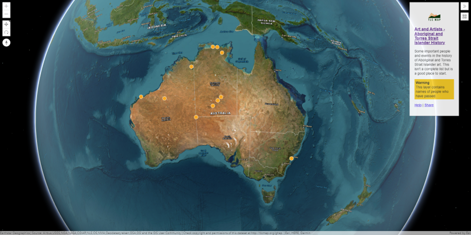
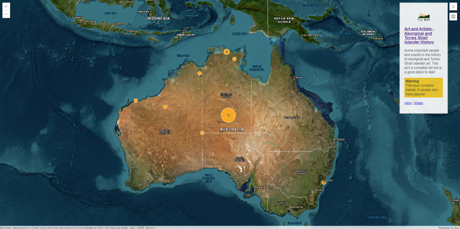
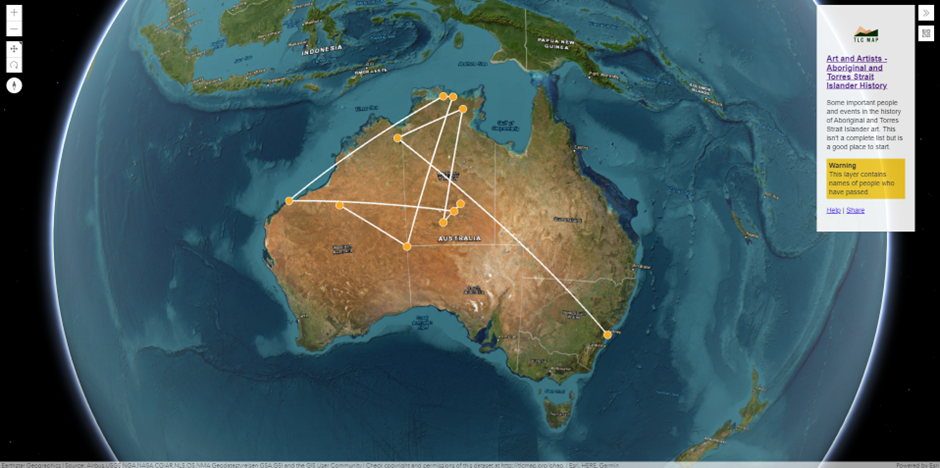
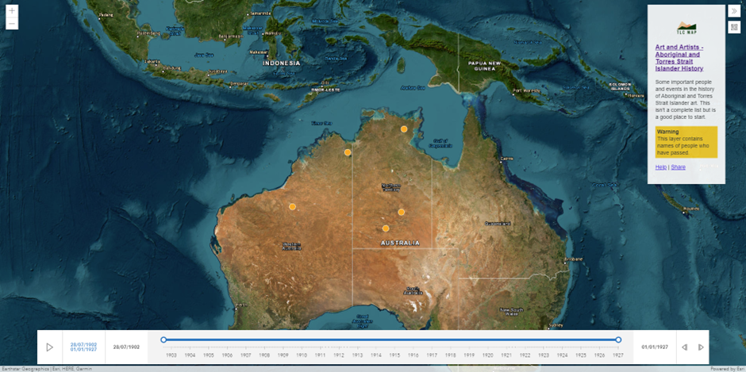
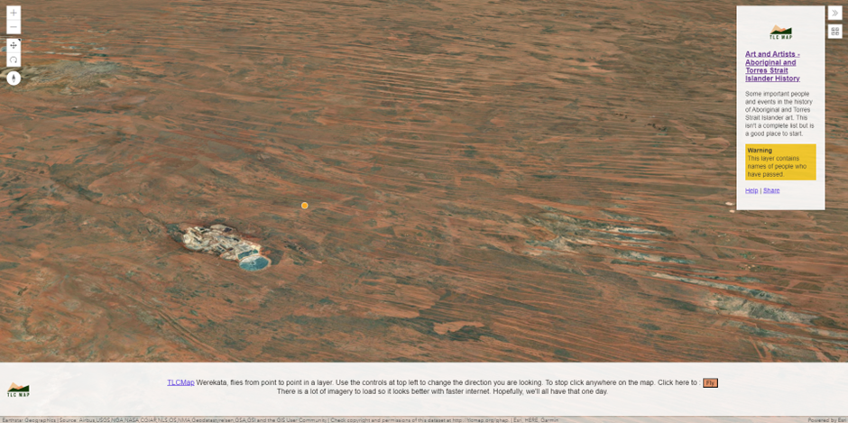

# Views

The library’s views are available at `https://views.tlcmap.org/v2/`. To use a view, the GeoJSON data MUST be hosted and
have a web URL. The view can then load the GeoJSON data by specifying its URL in the `load` parameter of the view’s URL
query string. The URL of the GeoJSON feed SHOULD be encoded, especially in the case of multiple parameters exist in the
URL query string.

For example:

The URL of the GeoJSON feed is:

```
https://ghap.tlcmap.org/publicdatasets/247/json
```

To use the 3D view, the URL would be:

```
https://views.tlcmap.org/v2/3d.html?load=https%3A%2F%2Fghap.tlcmap.org%2Fpublicdatasets%2F247%2Fjson
```

The view can be embedded to web pages using `<iframe>`:

```html
<iframe src="https://views.tlcmap.org/v2/3d.html?load=https%3A%2F%2Fghap.tlcmap.org%2Fpublicdatasets%2F247%2Fjson"
        width="1000" height="700" frameborder="0" scrolling="no"></iframe>
```

## 3D view

```
https://views.tlcmap.org/v2/3d.html
```



The 3D view shows dots on a 3D map. This is the most basic visualisation and good for simple maps. It renders all
features from the GeoJSON feed as point markers in the map.

## Cluster view

```
https://views.tlcmap.org/v2/cluster.html
```



The Cluster view shows dots close to each other merged into a large dot with a number indicating how many points are in
it. This map is best for large amounts of data, or large search results, or if points are very close together.

## Journey view

```
https://views.tlcmap.org/v2/journey.html
```



Journey view shows dots and lines between them in a 3D map. In addition to the place `Feature` objects in the GeoJSON
feed, `Feature` objects representing the paths SHOULD also be specified in the `FeatureCollection`. Each path is a
`Feature` object with a `LineString` geometry object as the member. The geometry object contains the list of
coordinates building the path. Note that the order of coordinates is important as the path will be built based on that
order.

For example:

```json
{
    "type": "FeatureCollection",
    "metadata": {
        "id": "7923",
        "name": "Art and Artists - Aboriginal and Torres Strait Islander History",
        "description": "Some important people and events in the history of Aboriginal and Torres Strait Islander art. This isn't a complete list but is a good place to start."
    },
    "features": [
        {
            "type": "Feature",
            "geometry": {
                "type": "Point",
                "coordinates": [
                    122.271124,
                    -21.66354
                ]
            },
            "properties": {
                "name": "Rover Thomas"
            }
        },
        {
            "type": "Feature",
            "geometry": {
                "type": "Point",
                "coordinates": [
                    128.997503,
                    -26.003461
                ]
            },
            "properties": {
                "name": "Western Desert Art Movement"
            }
        },
        {
            "type": "Feature",
            "geometry": {
                "type": "Point",
                "coordinates": [
                    133.920752,
                    -12.050407
                ]
            },
            "properties": {
                "name": "Narwala Gabarnmang"
            }
        },
        {
            "type": "Feature",
            "geometry": {
                "type": "Point",
                "coordinates": [
                    133.015762,
                    -11.953818
                ]
            },
            "properties": {
                "name": "Maliwawa Figures"
            }
        },
        {
            "type": "Feature",
            "geometry": {
                "type": "Point",
                "coordinates": [
                    116.833162,
                    -20.557288
                ]
            },
            "properties": {
                "name": "Murujuga, WA"
            }
        },
        {
            "type": "Feature",
            "geometry": {
                "type": "LineString",
                "coordinates": [
                    [128.997503, -26.003461],
                    [122.271124, -21.66354],
                    [116.833162, -20.557288]
                ]
            },
            "properties": {
                "name": "Path 1"
            }
        },
        {
            "type": "Feature",
            "geometry": {
                "type": "LineString",
                "coordinates": [
                    [133.920752, -12.050407],
                    [133.015762, -11.953818],
                    [116.833162, -20.557288]
                ]
            },
            "properties": {
                "name": "Path 2"
            }
        }
    ]
}
```

## Timeline view

```
https://views.tlcmap.org/v2/timeline.html
```



The timeline view shows an interactive timeline on the map so you can see where events occurred across time. You can
move each end back and forward, or select a range and "play" it to watch events show up and disappear in the moving
time window. This map is best for collections of events with dates and locations, such as where incidents occurred
across the country, or times that institutional sites started and ceased operation. It’s also an alternative for
viewing journeys with dates.

To get a place displayed in the timeline view, the `Feature` object MUST have the values of `udatestart` and `udateend`
in its properties, which are sets the start and end time of the place. The values of `udatestart` and `udateend` MUST be
UNIX timestamp in **milliseconds**. If the original time is the UNIX timestamp in seconds, it needs to be multiplied by
1000 in the GeoJSON feed.

For example, to set a place with start date `1902-07-28` and end date `1959-08-08`:

```json
{
    "type": "Feature",
    "geometry": {
        "type": "Point",
        "coordinates": [
            122.271124,
            -21.66354
        ]
    },
    "properties": {
        "name": "Rover Thomas",
        "description": "Rover Thomas was an artist of the East Kimberley School and inspired fellow East Kimberley artists, such as Queenie McKenzie. His works were the subject of the solo exhbition \"Roads Cross: The Paintings of Rover Thomas\" at the National Gallery of Australia, Canberra in 1994.",
        "id": "tb326",
        "udatestart": -2127981600000,
        "udateend": -328269600000
    }
}
```

> [!NOTE]
> All places without the `udatestart` and `udateend` properties will be ignored from the timeline view.

## Werekata view

```
https://views.tlcmap.org/v2/werekata.html
```



The Werekata view shows a 3D map with a flying bird’s eye view moving from point to point on a journey route. This map
is for animating a journey route. It enables you to better imagine how the journey may feel in person.
‘Werekata’ is Awabakal for kookaburra.

The order of Feature objects in the FeatureCollection defines the order of places the view will fly to.
